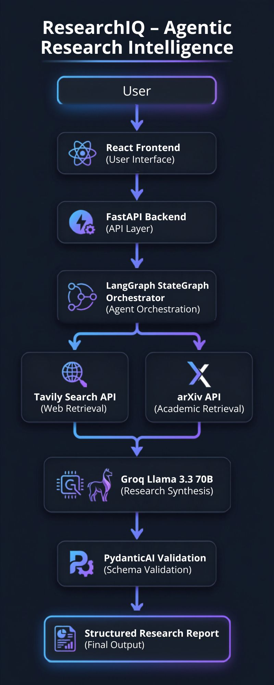
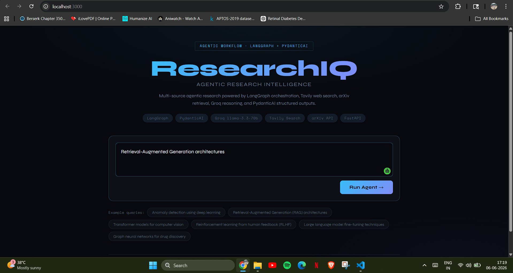
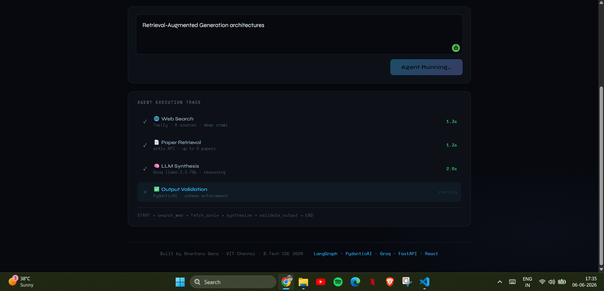
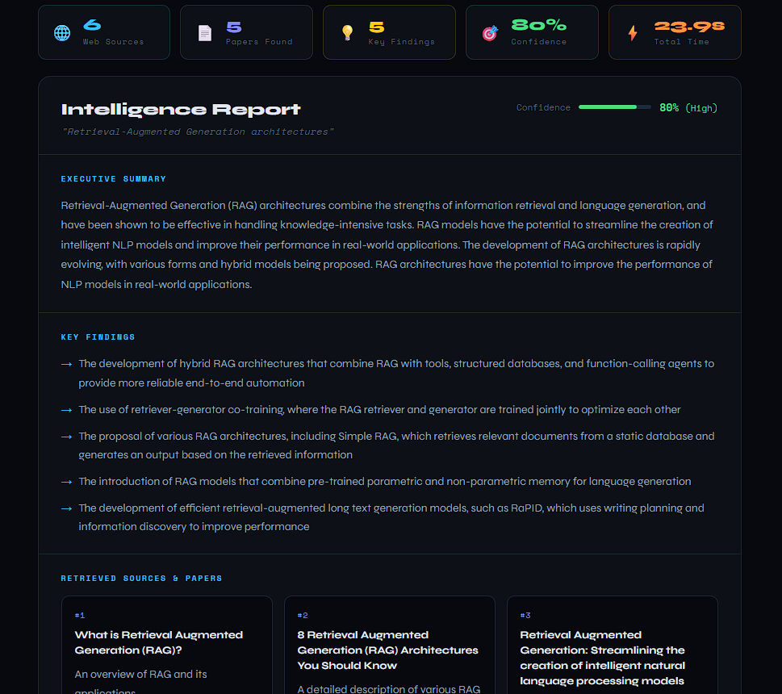
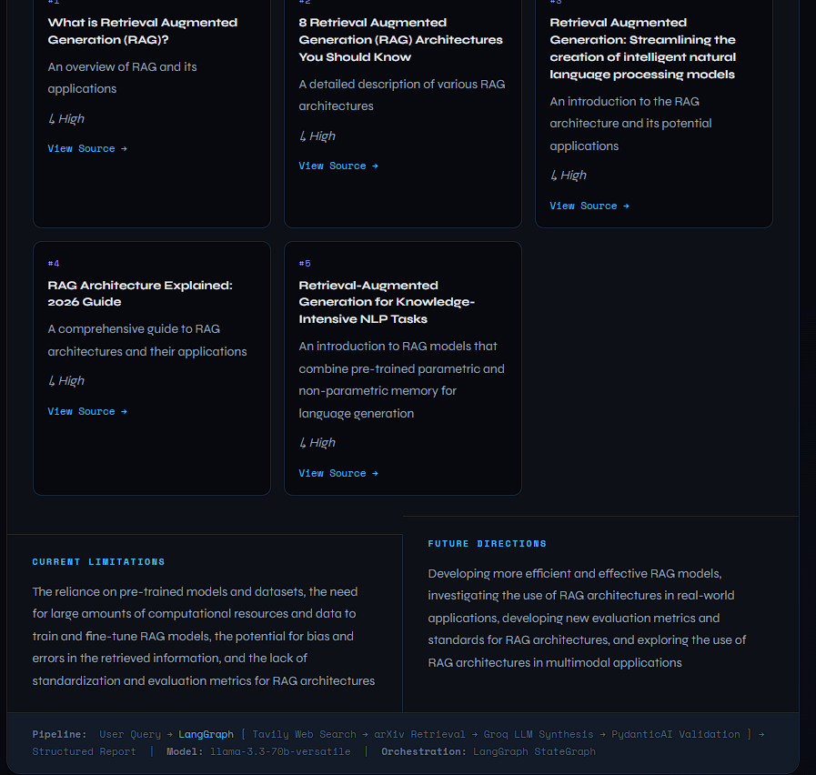

# ⚡ ResearchIQ — Agentic Research Intelligence

A domain-agnostic agentic research workflow that takes any query, autonomously calls multiple tools in a LangGraph pipeline, and returns a structured intelligence report validated by PydanticAI.

> **One-liner:** Multi-source agentic research powered by LangGraph orchestration, Tavily web search, arXiv retrieval, Groq reasoning, and PydanticAI structured outputs.

---

## System Architecture

<p align="center">
  
</p>


## Product Walkthrough

### Landing Page



### Agent Execution Trace



### Structured Research Report

#### Executive Summary & Findings



#### Sources, Limitations & Future Directions




### Tools Called Autonomously
| Node | Tool | Purpose |
|------|------|---------|
| `search_web` | Tavily Search API | Web search — 6 deep-crawled sources |
| `fetch_arxiv` | arXiv REST API (free) | Academic paper retrieval |
| `synthesize` | Groq llama-3.3-70b | LLM reasoning & synthesis |
| `validate_output` | PydanticAI + Groq | Schema enforcement & structured output |

### Bonus Technologies Used
- ✅ **LangGraph** — agentic graph orchestration (StateGraph)
- ✅ **PydanticAI** — structured output validation
- ✅ **Groq API** — free, ultra-fast LLM inference (llama-3.3-70b-versatile)

---

## Setup

### Prerequisites
- Python 3.10+
- Node.js 18+
- Groq API key (free) → https://console.groq.com
- Tavily API key (free tier) → https://app.tavily.com

### Backend

```bash
cd backend

# Copy env template and add your keys
cp .env.example .env

# Install dependencies
pip install -r requirements.txt

# Run the server
uvicorn main:app --reload --port 8000
```

Backend runs at `http://localhost:8000`
API docs at `http://localhost:8000/docs`

### Frontend

```bash
cd frontend

npm install
npm start
```

Frontend runs at `http://localhost:3000`

---

## API

### `POST /research`

**Request:**
```json
{
  "query": "Anomaly detection using deep learning"
}
```

**Response:**
```json
{
  "success": true,
  "report": {
    "query": "...",
    "overview": "...",
    "key_findings": ["...", "..."],
    "papers": [
      {
        "title": "...",
        "summary": "...",
        "relevance": "...",
        "source": "https://..."
      }
    ],
    "limitations": "...",
    "future_directions": "...",
    "confidence": 0.85
  }
}
```

---

## Design Decisions

1. **LangGraph over raw loops** — an explicit node-edge StateGraph makes the workflow inspectable, debuggable, and extensible. Adding a new data source = adding one node and one edge.

2. **PydanticAI for output validation** — guarantees the LLM always returns a typed, structured object. If the model returns malformed output, PydanticAI retries with corrective prompting automatically.

3. **Two complementary retrieval tools** — arXiv gives peer-reviewed academic depth; Tavily gives real-time web recency. Together they cover both research and industry perspectives.

4. **Groq (free tier)** — llama-3.3-70b-versatile delivers sub-2-second inference, making the agent feel responsive. Chosen deliberately over paid APIs to keep the stack fully free.

5. **FastAPI + React** — FastAPI for its native Pydantic integration and async support; React for a responsive UI that visualises the agent pipeline in real time.

---

## Limitations & What I'd Improve Next

- **No streaming** — the synthesis step takes 10–15s with no token-level feedback. Next step: SSE streaming from FastAPI to show Groq tokens as they arrive.
- **Stateless** — each query is independent. Would add LangGraph checkpointing for multi-turn research sessions with memory.
- **arXiv not ranked by citations** — integrating Semantic Scholar API would surface higher-impact papers.
- **Single-user, no auth** — would add JWT-based auth for multi-user deployment.

---

## Project Structure

```
research-agent/
├── backend/
│   ├── agent.py          # LangGraph pipeline + PydanticAI
│   ├── main.py           # FastAPI server
│   ├── requirements.txt
│   └── .env.example
└── frontend/
    ├── public/index.html
    └── src/
        ├── App.js        # React UI — pipeline trace, metrics, report
        └── App.css
```

---

## Video Demo Outline (3–5 min)

1. **Problem** (30s) — Manual research is slow; this agent covers web + academic sources autonomously in one query
2. **Architecture** (90s) — Walk through the LangGraph StateGraph, explain each node and tool
3. **Live Demo** (2 min) — Run a query live, show the 4-step pipeline animating with per-step timing, scroll through the structured report and metrics bar
4. **Limitation + Next Step** (30s) — No streaming today; would add FastAPI SSE for real-time token output

---

*Built by Shantanu Gera · VIT Chennai · B.Tech CSE 2026*
*Stack: LangGraph · PydanticAI · Groq · Tavily · arXiv · FastAPI · React*
